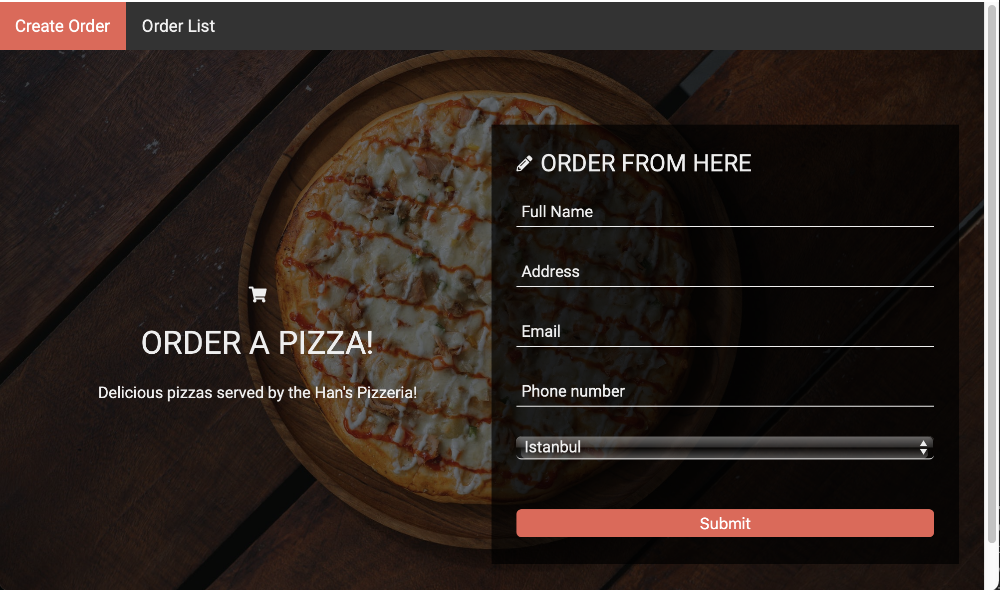

# Pizza Order System
## _Made with Spring Framework by Denizhan Aras_

Pizza Order System is a basic website which gets an order from user and store this order data inside of a in-memory database. There are 6 different pizza types in the system.

- Made with Spring Framework and Thymeleaf.
- Front-end included. (at localhost:8080)
- H2 Engine used. (in-memory database)
- Tested with Front-end.
- Check below for details.

## Create an Order
- Use localhost:8080 or localhost:8080/order.

## List All & Delete an Order
- localhost:8080/orderlist or top-nav menu.

## Custom Error page

